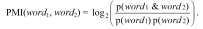
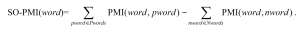

# Comment_Attitude
使用SO-PMI算法，实现外卖评论的关键情感词提取。
根据外卖评论数据集对正负情感分别选择情感种子词，计算数据集中最具有正向/负向情感的候选词。

## 数据集文件

外卖评论.csv（存储的是待处理的评论文本，按条统计，正向约4000条，负向约8000条，每条的格式为”0, 评论文本”或”1，评论文本”）

## Preparation

 为了选取更典型更具有代表性的正向负向情感种子词，通过jieba来进行直接的分词后，统计得到评论中的词频排序结果，并存储到文件word_sta.txt中。我们把此文件作为依据来选取种子词和无关词，将所选取的种子词和无关词分别保存到两个输入文件中。

seed_words.txt（存储的是SO-PMI算法的需要的种子词，存储的格式是“种子词\t词性”，词性为”pos”和”neg”）

irrelevant_words.txt（存储的是无意义的词语，例如“我”、“是”以及常见标点符号等，以减少后续分析的规模。事实上，我们也尝试了不去除无关词，最终得到的关键情感词结果相差不大）

## SO-PMI算法实现

### 名词说明

+ **待筛选词**：分词得到的结果，非种子词
+ **共现关系**：用来描述两词语单位在文本的一定范围内同时出现
+ **共现词**：是待筛选词，且已经确定和种子词有共现关系
+ **共现对**：一对词语，一个是种子词，一个是共现词

 ### 实现步骤

1. **分词**

   参数：cmt_path(外卖评论.csv的存储路径)、irlv_path(irrelevant_words.txt的存储路径)

   功能和实现：读取外卖评论.csv的内容，使用jieba来实现分词，并去除无关词（依据irlv_path）

   返回值：seg_data （类型是list的list，即[[],[],…,[]]，存储的内容是每条评论对应的待筛选词语）

2. **查找并统计共现关系**

   对共现关系的定义：词语A与词语B步长不超过neighborhood_size，则称A和B有共现关系

   参数：seed_path（seed_words.txt的存储位置）、seg_data（文本中的待筛选词）

   功能和实现：遍历seg_data，依照共现关系的定义，存储出现的所有共现对

   返回值：cowords_list(类型list, 我们将共现关系以“种子词\t共现词”的形式存储)

3. **统计词频和共现关系出现的次数**

   参数：seg_data、cowords_list、seed_path

   功能和实现：遍历并分析seg_data和cowords_list，统计词语和共现关系出现的总次数

   返回值：word_dict（类型dict，dict[带筛选词]存储的是全文本中待筛选词出现的总次数）、num_of_allwords（该文本中出现的所有词语元素的总个数，用于计算频率）、co_dict（类型dict，以cowords_list中的元素作为索引，存储的是共现关系出现的总次数）、candi_words(类型list，存储的是和任意种子词出现共现关系的待筛选词)

4. **计算待筛选词的SO-PMI结果**

   参数：candi_words、seed_path、 word_dict、 co_dict、 num_of_allwords

   功能和实现：通过co_dict的内容统计待筛选词与正向种子词和负向种子词共现的次数，并根据公式和计算出所有共现词的SO-PMI结果

   返回值：pmi_dict（类型dict，dict[共现词]存储的是共现词的SO-PMI结果)

5. **输出结果**

   参数：pmi_dict、 posword_path（正向词存储的文件路径）、 negword_path（负向词存储的文件路径）

   功能和实现：排序pmi_dict的内容，并分别将最具有正向/负向情感的前50个词输出到pos_words.txt和neg_words.txt中

